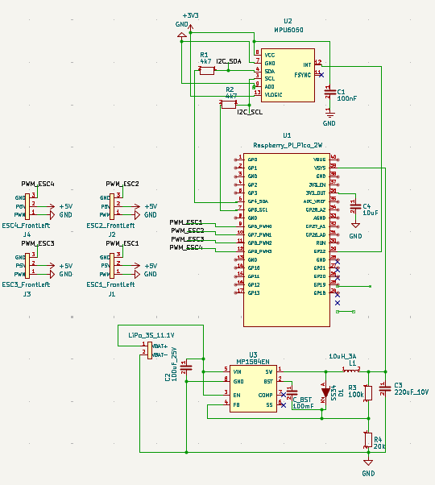
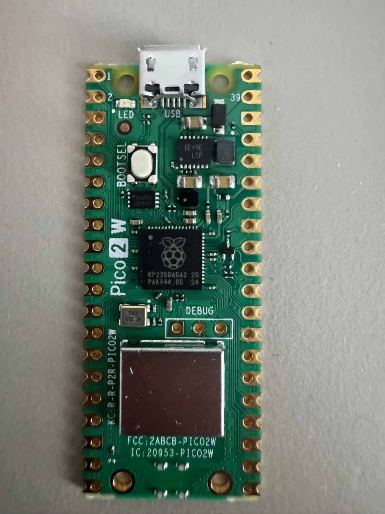
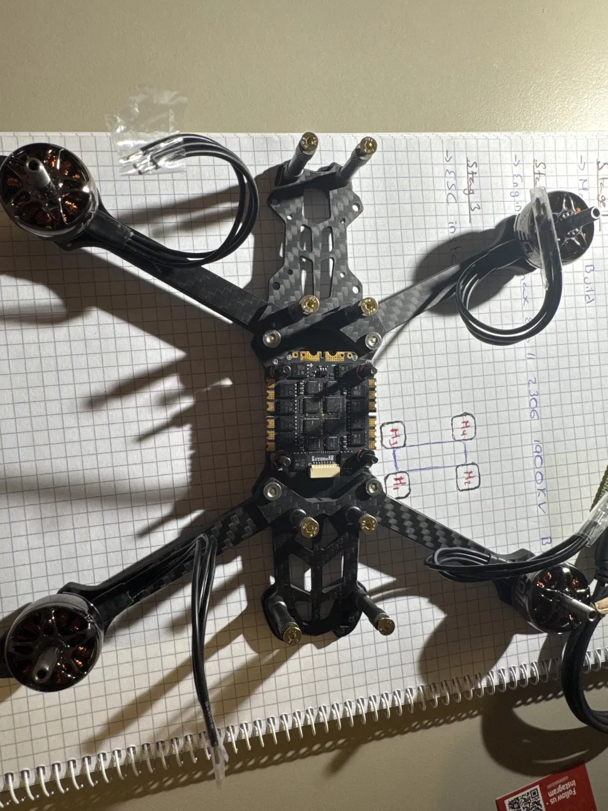
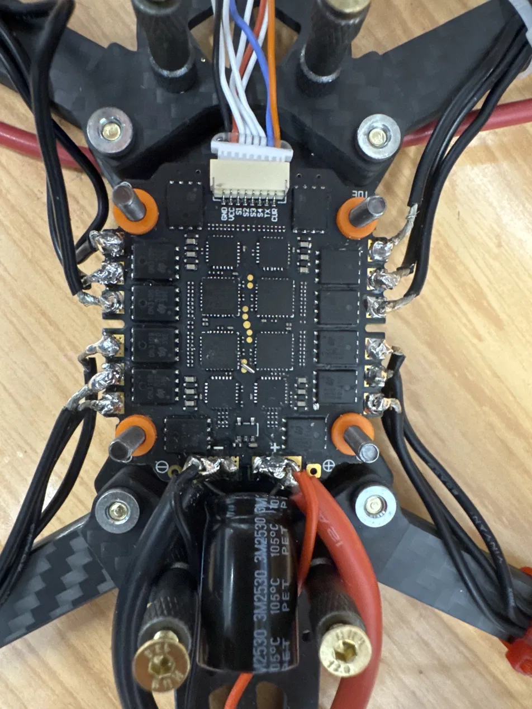
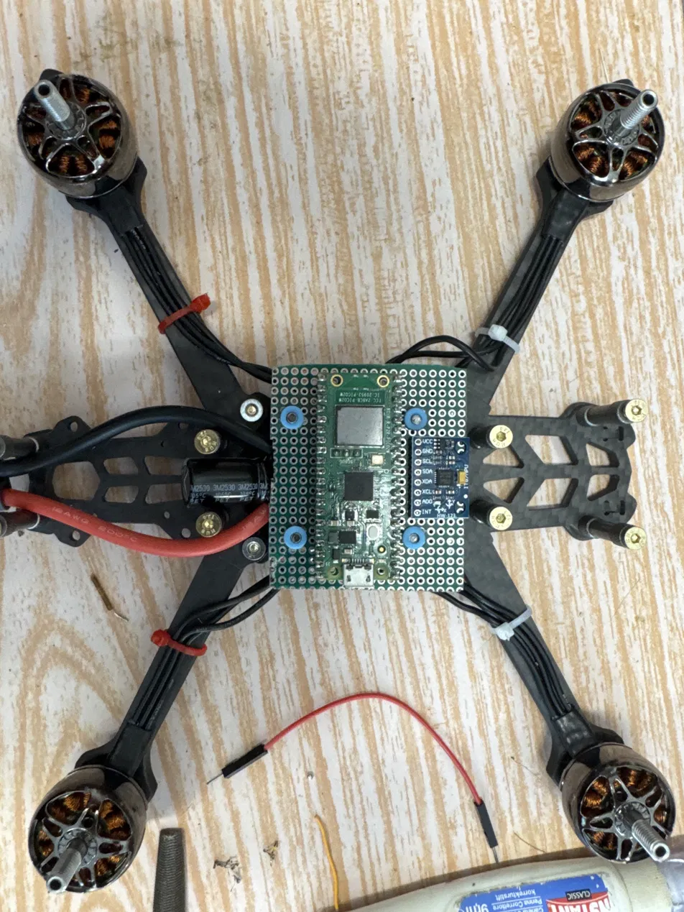

# Auto Stabilizin Quadcopter

A from-scratch flight controller for an auto-stabilizing quadcopter, built on the Raspberry Pi Pico 2 W (RP2350) and piloted entirely over a custom Wi-Fi UDP protocol from a PC

Author: Carlos Artacho

## Description
SkyRust is a custom flight controller designed and built from the ground up. Instead of dropping in an off-the-shelf board like a Betaflight F4 or a CC3D, every layer of this project is hand-engineered: the circuit lives on an FR4 perfboard with point-to-point soldering, the firmware is written in no_std Rust using the Embassy async framework, and the radio link is replaced entirely by a custom Wi-Fi UDP protocol communicating with a PC client.ç

The core features are:

Wi-Fi UDP Control: Throttle, pitch, roll, and yaw commands are streamed from a PC client over Wi-Fi using a custom UDP protocol, leveraging the Pico 2 W's onboard CYW43439 chip.
Async PID Auto-Stabilization: A Ticker-based PID control loop runs on a fixed millisecond schedule, continuously adjusting motor outputs to keep the airframe level.
DShot Digital Motor Protocol: ESC commands are sent via DShot (a fully digital, bidirectional protocol) rather than analog PWM, eliminating calibration and improving noise immunity.
Sensor Fusion: Raw gyroscope and accelerometer data from the MPU-6050 is read over I2C and filtered in software to produce clean pitch/roll/yaw orientation estimates.
Software Failsafe: If no valid UDP packet is received within 200 ms, all motors are immediately commanded to zero throttle — preventing a flyaway in case of Wi-Fi loss.

## Motivation
This project combines every major topic covered during the semester — embedded Rust, async programming, digital communication protocols, sensor interfacing, and real-time control — into a single, physically flying system.

## System Overview
The system is split into two physical domains:

Ground Station — a PC running a Rust UDP client that reads keyboard input and streams control packets to the drone.
Airframe — the Mark4 quadcopter frame carrying the custom perfboard, the ESC, four brushless motors, and a 3S LiPo battery.

## Software Architecture
The firmware runs on a single RP2350 core using Embassy's async executor. All tasks are cooperative and non-blocking:

1. udp_server_taskListens on a UDP socket
parses incoming control packets (throttle, pitch, roll, yaw); updates shared state.

2. failsafe_monitorWatches
the timestamp of the last valid packet; forces throttle to zero if the gap exceeds 200 ms.

3. imu_reader_taskPolls
MPU-6050 registers over I2C; applies a complementary filter; writes orientation estimates to shared state.

4. pid_control_loop
Ticker-driven task; reads setpoint vs. actual orientation; computes per-axis PID corrections.

5. motor_mixer_task
Combines throttle + PID corrections into four DShot duty-cycle values; drives ESC signal lines via PIO.

## Hardware Architecture
The custom perfboard implements three distinct functional layers:

Logic layer: Raspberry Pi Pico 2 W (RP2350) — main MCU, Wi-Fi, DShot signal generation via PIO, I2C master.
Sensing layer: MPU-6050 GY-521 module — 3-axis gyroscope + 3-axis accelerometer, connected via I2C.
Power layer: MINI560 buck converter — steps down the 11.1V LiPo supply to a clean, regulated 5V for the Pico. The Mamba F45 ESC does not have an onboard BEC, so this external regulator is essential.

Layout principles applied on the perfboard:

IMU placed at the geometric center of the board to prevent rotational offset errors.
MINI560 placed at the far edge to spatially separate switching noise from logic signals.
Star-grounding topology: all GND connections converge at a single central pad.
I2C signal wires routed on the underside using AWG 30 wire-wrap, kept short and away from power traces

## Hardware

### Pin Connections

#### MPU-6050 → Pico 2W (I2C)

| MPU-6050 Pin | Pico 2W Pin | Physical Pin |
|---|---|---|
| VCC | 3V3 OUT | 36 |
| GND | GND | 38 |
| SDA | GP6 | 9 |
| SCL | GP7 | 10 |

#### Mamba F45 ESC → Pico 2W (DShot)

| ESC Pad | Pico 2W GPIO | Physical Pin | Role |
|---|---|---|---|
| GND | GND | 3 | Common ground |
| S1 | GP0 | 1 | DShot → Motor 1 (front-left) |
| S2 | GP1 | 2 | DShot → Motor 2 (front-right) |
| S3 | GP2 | 4 | DShot → Motor 3 (rear-right) |
| S4 | GP3 | 5 | DShot → Motor 4 (rear-left) |
| TX | GP5 (RX) | 7 | ESC telemetry UART (optional) |

#### Power Supply

| From | To | Notes |
|---|---|---|
| LiPo XT60 | Mamba F45 BAT+/BAT− | Direct high-current connection |
| LiPo | MINI560 IN+ / IN− | Also direct from battery bus |
| MINI560 OUT+ (5V) | Pico VSYS (pin 39) | Regulated 5V to Pico |
| MINI560 OUT− | Pico GND (pin 38) | Common ground |

### Schematic

### Photos

| | |
|---|---|
|  |  |
|  |  |