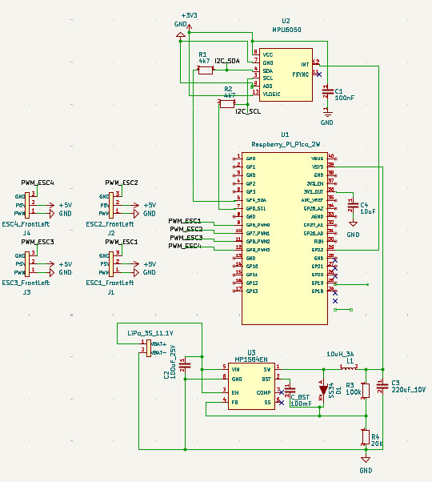
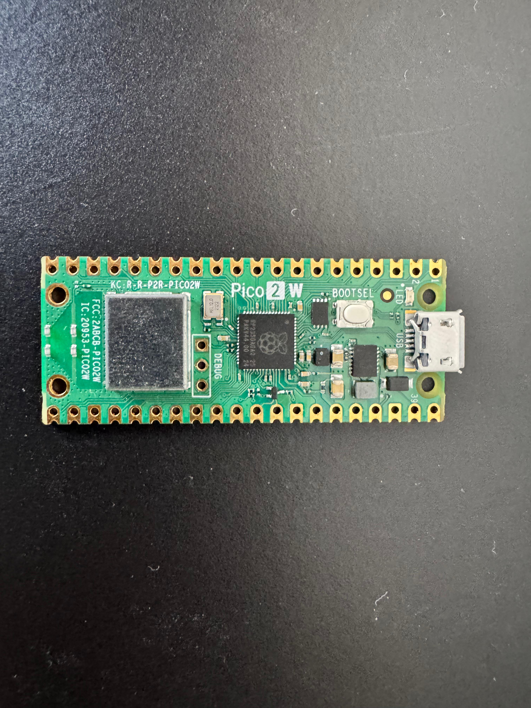
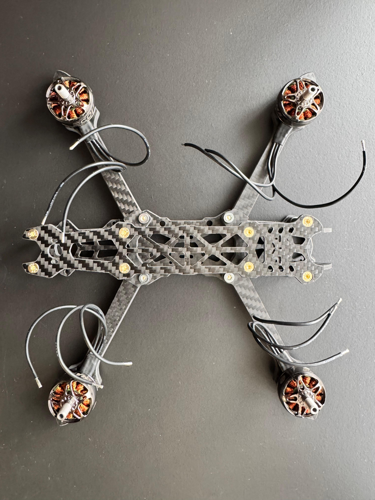
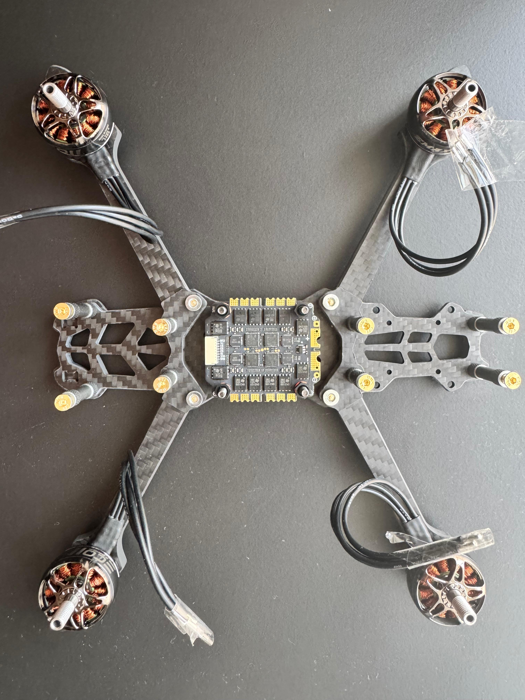
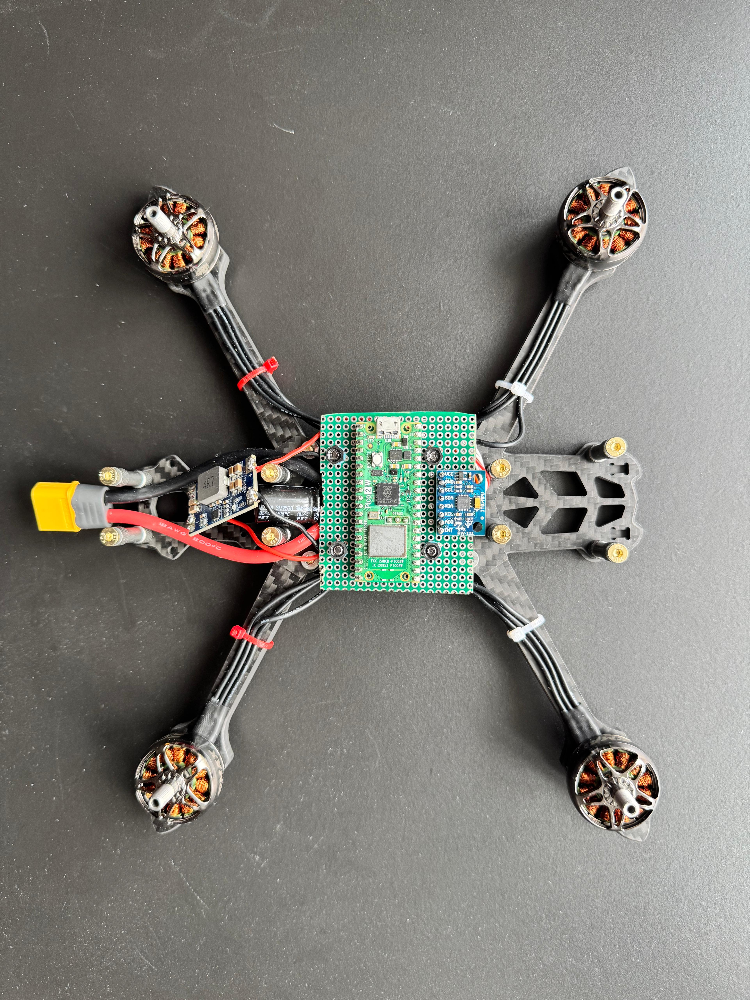
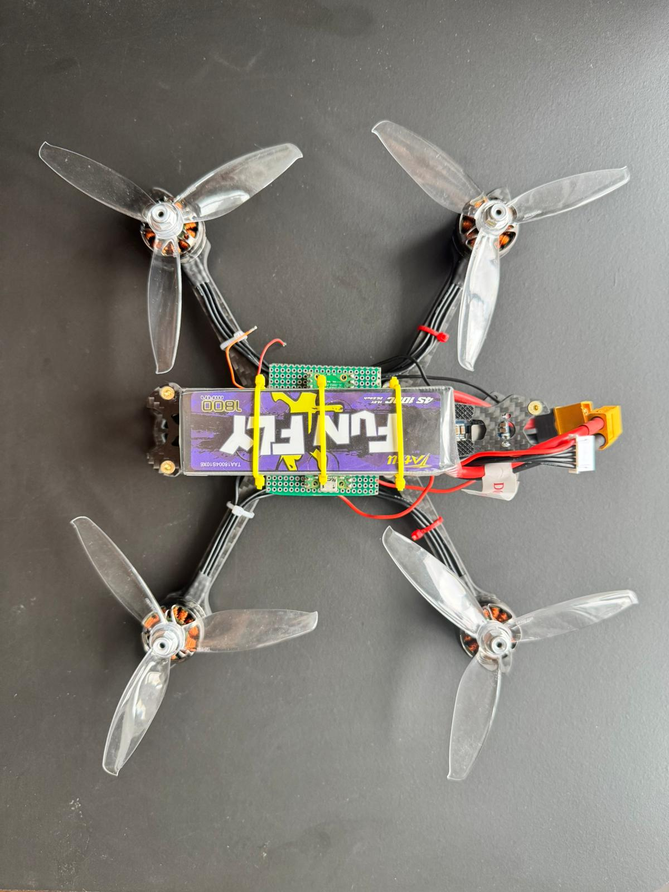
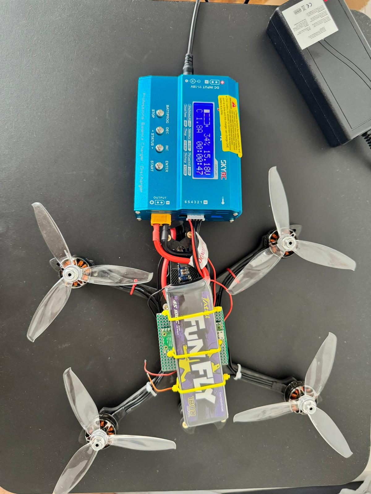

# Auto-Stabilizing Wi-Fi Quadcopter

A from-scratch flight controller for an auto-stabilizing quadcopter, built on the Raspberry Pi Pico 2 W (RP2350) and piloted entirely over a custom Wi-Fi UDP protocol from a PC.

**Author:** Carlos Artacho
**Repository:** https://github.com/carlibar50/Auto-Stabilizing-Quadcopter

## Description

Custom flight controller designed and built from the ground up. Instead of dropping in an off-the-shelf board like a Betaflight F4 or a CC3D, every layer of this project is hand-engineered: the circuit lives on an FR4 perfboard with point-to-point soldering, the firmware is written in `no_std` Rust using the Embassy async framework, and the radio link is replaced entirely by a custom Wi-Fi UDP protocol communicating with a PC client.

The core features are:

- **Wi-Fi UDP Control:** Throttle, pitch, roll, and yaw commands are streamed from a PC client over Wi-Fi at 50 Hz using a custom UDP protocol, leveraging the Pico 2 W's onboard CYW43439 chip.
- **Async PID Auto-Stabilization:** A `Ticker`-based PID control loop runs on a fixed millisecond schedule, continuously adjusting motor outputs to keep the airframe level. PID gains are tunable live from the PC client.
- **DShot Digital Motor Protocol:** ESC commands are sent via DShot300 (a fully digital protocol) rather than analog PWM, eliminating calibration and improving noise immunity.
- **Sensor Fusion:** Raw gyroscope and accelerometer data from the MPU-6050 is read over I2C and filtered in software with a complementary filter to produce clean pitch/roll orientation estimates.
- **Software Failsafe:** If no valid UDP packet is received within the timeout window, all motors are immediately commanded to zero throttle, preventing a flyaway in case of Wi-Fi loss.

## Motivation

This project combines every major topic covered during the semester — embedded Rust, async programming, digital communication protocols, sensor interfacing, and real-time control — into a single, physically flying system.

The choice of a quadcopter is deliberate: flight requires all subsystems to work simultaneously and correctly. A broken PID loop or a missed DShot frame is not an abstract bug; it is immediately visible as a crash. Replacing the standard RC radio link with a Wi-Fi UDP protocol adds a networking layer and a custom safety mechanism that would not exist in a conventional drone project. Building the circuit on a perfboard rather than using a prebuilt carrier board ensures a deep understanding of power distribution, noise isolation, and signal routing.

## System Overview

The system is split into two physical domains:

- **Ground Station** — a PC running a Python UDP client that reads keyboard input and streams control packets to the drone, while also allowing live PID gain tuning.
- **Airframe** — the Mark4 quadcopter frame carrying the custom perfboard, the ESC, four brushless motors, and a 3S LiPo battery.

## Software Architecture

The firmware runs on a single RP2350 core using Embassy's async executor. All tasks are cooperative and non-blocking, communicating through shared state protected by `Mutex<CriticalSectionRawMutex, _>`:

| Task | Description |
|---|---|
| `usb_task` | Manages the USB CDC-ACM serial interface for telemetry and debugging output. Uses non-blocking sends to avoid boot freezes. |
| `udp_task` | Listens on a UDP socket; parses incoming 20-byte control packets (throttle, pitch, roll, yaw, Kp, Ki, Kd); updates shared state and the failsafe timestamp. |
| `imu_task` | Polls the MPU-6050 over I2C; runs a startup calibration routine; applies a complementary filter; writes pitch/roll/yaw-rate estimates to shared state. |
| `pid_task` | `Ticker`-driven loop; reads setpoint vs. actual orientation; computes per-axis PID corrections; runs the motor mixer; enforces the failsafe. |
| `motor_task` | Reads the mixed motor values and transmits DShot300 frames to all four ESCs simultaneously inside an interrupt-free block. |

### Shared-State Design

Rather than message-passing between every task, the firmware uses a set of global `Mutex`-protected structs (`SETPOINT`, `ORIENTATION`, `MOTORS`, `PID_PARAMS`, `LAST_PKT`). Each task locks only briefly to read or write, which keeps the async executor responsive and avoids priority inversion between the high-rate motor loop and the slower network task.

### Control Protocol

The PC client sends a fixed 20-byte little-endian packet at 50 Hz:

| Offset | Field | Type | Units |
|---|---|---|---|
| 0 | throttle | u16 | 0-2000 (DShot) |
| 2 | pitch | i16 | centidegrees |
| 4 | roll | i16 | centidegrees |
| 6 | yaw_rate | i16 | centidegrees/s |
| 8 | Kp | f32 | gain |
| 12 | Ki | f32 | gain |
| 16 | Kd | f32 | gain |

Python pack format: `struct.pack('<Hhhhfff', ...)`.

## Hardware Architecture

The custom perfboard implements three distinct functional layers:

- **Logic layer:** Raspberry Pi Pico 2 W (RP2350) — main MCU, Wi-Fi, DShot signal generation, I2C master.
- **Sensing layer:** MPU-6050 GY-521 module — 3-axis gyroscope + 3-axis accelerometer, connected via I2C.
- **Power layer:** MINI560 buck converter — steps down the 11.1V LiPo supply to a regulated 5V for the Pico. The Mamba F45 ESC does not have an onboard BEC, so this external regulator is essential.

Layout principles applied on the perfboard:

- IMU placed near the geometric center of the board to minimize rotational offset errors.
- MINI560 placed at the far edge to spatially separate switching noise from logic signals.
- Star-grounding topology: all GND connections converge at a single central pad.
- I2C signal wires routed on the underside using AWG 30 wire-wrap, kept short and away from power traces.

## Hardware

### Pin Connections

#### MPU-6050 to Pico 2W (I2C)

| MPU-6050 Pin | Pico 2W Pin | Physical Pin |
|---|---|---|
| VCC | 3V3 OUT | 36 |
| GND | GND | 38 |
| SDA | GP6 | 9 |
| SCL | GP7 | 10 |

#### Mamba F45 ESC to Pico 2W (DShot)

| ESC Pad | Pico 2W GPIO | Physical Pin | Role |
|---|---|---|---|
| GND | GND | 3 | Common ground |
| S1 | GP0 | 1 | DShot to Motor 1 (front-left) |
| S2 | GP1 | 2 | DShot to Motor 2 (front-right) |
| S3 | GP2 | 4 | DShot to Motor 3 (rear-right) |
| S4 | GP3 | 5 | DShot to Motor 4 (rear-left) |
| TX | GP5 (RX) | 7 | ESC telemetry UART (optional) |

#### Power Supply

| From | To | Notes |
|---|---|---|
| LiPo XT60 | Mamba F45 BAT+/BAT- | Direct high-current connection |
| LiPo | MINI560 IN+ / IN- | Also direct from battery bus |
| MINI560 OUT+ (5V) | Pico VSYS (pin 39) | Regulated 5V to Pico |
| MINI560 OUT- | Pico GND (pin 38) | Common ground |

### Schematic

### Photos

| | |
|---|---|
|  |  |
|  |  |
|  |  |

## Bill of Materials

### Hardware

| Component | Model | Qty | Role |
|---|---|---|---|
| MCU Board | Raspberry Pi Pico 2 W (RP2350) | 1 | Main MCU + Wi-Fi |
| IMU | MPU-6050 GY-521 | 1 | Gyro + accelerometer (I2C) |
| ESC | Mamba F45 (4-in-1) | 1 | Motor drivers (DShot300) |
| Motors | ECOII 2306 brushless | 4 | Propulsion |
| Frame | Mark4 quadcopter frame | 1 | Chassis |
| Buck converter | MINI560 5V | 1 | 11.1V to 5V regulation |
| Battery | 3S 11.1V LiPo | 1 | Main power supply |
| Capacitor | 470uF / 35V electrolytic | 1 | Bulk capacitance |
| Perfboard | FR4 universal | 1 | Structural base |
| Wiring | AWG 30 wire-wrap, AWG 22 power | - | Signal + power routing |
| Connector | XT60 pair | 1 | Battery connection |

### Software

| Crate | Role |
|---|---|
| `embassy-rp` | RP2350 HAL - GPIO, I2C, PIO, USB |
| `embassy-executor` | Async task executor |
| `embassy-net` | UDP socket stack |
| `embassy-time` | `Ticker`, `Timer`, `Instant` for PID scheduling and failsafe |
| `cyw43` / `cyw43-pio` | CYW43439 Wi-Fi driver |
| `embassy-usb` | USB CDC-ACM for telemetry |
| `embedded-hal-async` | Async I2C traits for the MPU-6050 |
| `defmt` / `defmt-rtt` | Embedded logging |
| `panic-probe` | Panic handler |

## Results and Achievements

- **Asynchronous software architecture:** Multiple parallel tasks (USB, Wi-Fi, IMU, PID, motors) running without RTOS blocking, on top of `embassy-rp`.
- **Wireless communications:** CYW43439 integration over a mobile hotspot, with latency low enough to send telemetry and receive control commands (throttle, pitch, roll, yaw, and live PID gains) at 50 Hz.
- **Hardware drivers:**
  - Stable I2C communication with the MPU-6050, including a calibration routine and a complementary filter for accurate pitch/roll computation.
  - Manual DShot protocol implementation using a `critical_section` block to guarantee nanosecond-level timing and prevent Wi-Fi interrupts from corrupting the motor signal.
- **Ground station (Python):** A UDP client able to control thrust, display telemetry, and tune the PID gains in real time from the keyboard.
- **Initial physical validation:** Confirmed a 2:1 thrust-to-weight ratio. The Mamba F45 + ECOII 2306 combination responds correctly, reaching a tethered hover at roughly 50% of maximum DShot power.

## Troubleshooting Log

A number of substantial obstacles were diagnosed and solved during development:

1. **Boot freeze:** The system hung at startup due to the USB queues filling. Resolved by switching to non-blocking sends (`try_send`).
2. **Wi-Fi state lock:** The CYW43439 retained state from previous resets and got stuck in the "BOOTING" phase. Resolved with a hard reset, forcing the Wi-Fi power pin low for 250 ms at boot.
3. **Safety and dead zones:** Motors would not spin on the first throttle command. Resolved by adjusting the failsafe and guaranteeing a minimum throttle (THR ~ 100) to overcome motor start-up inertia.
4. **DShot signal rejection (jitter):** DShot frames were being rejected by the ESCs because of noise introduced by network interrupts. Resolved by isolating signal generation inside an interrupt-free block.

## Current Critical Incident: Hardware Failure

During tethered PID-tuning tests at a high thrust level (THR ~ 1000), the Raspberry Pi Pico 2W stopped responding entirely.

**Symptoms:**

- Board not recognized over USB.
- MPU-6050 left unpowered.
- Possible permanent damage to the RP2350.

**Probable causes:**

1. **BEC (MINI560) failure:** A reverse-voltage (Back-EMF) spike from the ECOII 2306 motors may have exceeded the 470uF capacitor's capacity, destroying the BEC and passing 14.8V directly to the Pico.
2. **Physical short:** Extreme vibration of the Mark4 frame could have caused a temporary solder bridge or a wire chafing against the FR4 perfboard.
3. **Ground loop:** Motor return current flowing back through the ESC signal cable (SH1.0) into the Pico's logic ground.

